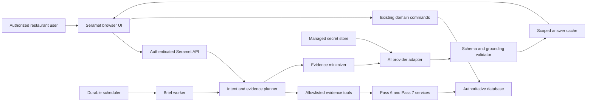

# Pass 9 Intelligence Threat Model

## Executive summary

Pass 9 introduces a new external trust boundary between Seramet's authoritative, tenant-scoped restaurant data and a configurable AI provider. The highest risks are cross-tenant or cross-branch evidence disclosure, source-permission bypass, secret or personal-data exfiltration, prompt injection through persisted restaurant text, unsupported financial claims, unsafe reuse of cached answers, and an AI response being mistaken for authority to mutate restaurant state. The implementation must therefore retrieve evidence only through allowlisted domain tools after server authorization, minimize and label that evidence, validate every model response, and route any accepted low-risk action through the existing permissioned command.

## Scope and assumptions

- In scope: `src/intelligence/**`, the Pass 9 API and workers, the `/ai` route, Pass 5 identity and database boundaries, Pass 6 inventory services, Pass 7 management read models, Pass 8 secrets and entitlements, and migration `0010`.
- Production is assumed to run the existing TanStack Start/Nitro server with bearer authentication, authoritative D1-compatible storage, a durable queue, HTTPS at the deployment edge, and a managed secret-store implementation.
- The service is multi-tenant and may contain financial, operational, employee, supplier, customer, and integration metadata.
- AI providers are optional and may be external processors. Provider contractual controls, regional processing, and legal retention terms are deployment concerns and remain go-live signoffs.
- Raw database access, arbitrary SQL, autonomous high-risk mutations, payroll interpretation, legal advice, and provider-specific model training are out of scope.
- The prompt supplies sufficient deployment assumptions for implementation; unresolved provider and privacy choices are recorded as pilot blockers rather than guessed.

Open questions that can change residual risk are the selected production provider's processing region and retention policy, the tenant's permitted staff/customer data categories, and whether production CSP and egress restrictions are enforced at the deployment edge.

## System model

### Primary components

- Browser UI: authenticated `/ai` experience and deterministic management screens. It receives sanitized structured output and never receives provider credentials.
- Seramet API: authenticates bearer sessions, resolves tenant and branch authority, validates runtime schemas, rate limits requests, and coordinates intelligence services. Existing authentication is in `src/lib/seramet-auth.ts`; API dispatch is in `src/lib/seramet-api.ts` and `src/server.ts`.
- Intelligence boundary: intent planner, allowlisted evidence registry, redaction, grounding validator, cache, usage controls, briefs, feedback, and safe-action policy.
- Authoritative domains: Pass 6 inventory/procurement and Pass 7 management/finance read models. `src/management/management-intelligence-service.ts` already calculates quality-aware financial, food-cost, channel, supplier, menu, kitchen, close, and branch-health facts.
- Authoritative database: D1-compatible repository and versioned migrations. `src/server/database/d1.ts` defines the database contract and `src/server/database/sqlite-test-adapter.ts` exercises migrations transactionally.
- Managed secret boundary: provider configuration stores only a secret reference; secret material is resolved server-side through `src/server/secrets.ts`.
- Durable workers: `src/server/workers.ts` claims, retries, and dead-letters scheduled jobs. Pass 9 adds idempotent brief generation.
- AI provider adapter: receives minimized structured evidence and returns a runtime-schema-validated answer. A deterministic test adapter is not a production provider.

### Data flows and trust boundaries

- Browser -> Seramet API: question, selected branch scope, session identifier, and explicit action confirmation over HTTPS/JSON. Bearer authentication, server branch resolution, Zod validation, rate limits, and permission checks apply.
- Seramet API -> evidence tools: normalized intent and authorized period/scope. The registry accepts only explicit tool identifiers and typed arguments; it exposes no SQL or generic query primitive.
- Evidence tools -> authoritative database/domain services: tenant and authorized branch predicates plus bounded periods. Domain calculations remain integer/deterministic and retain quality and source metadata.
- Intelligence boundary -> secret store: provider secret reference only. The resolved secret is passed directly to the provider adapter and excluded from evidence, logs, diagnostics, browser responses, and persistence.
- Intelligence boundary -> AI provider: minimized structured facts, prompt template version, and untrusted business strings clearly delimited as data. Provider timeout and bounded failure handling apply.
- AI provider -> grounding validator: structured output only. Runtime schema, numerical support, causal-language, evidence-reference, and action-policy checks run before storage or rendering.
- Validated answer -> database/cache/UI: tenant-scoped answer, evidence references, usage, quality, limitations, and prompt/model metadata. Cache keys include tenant, actor permission fingerprint, branch scope, intent, period, and evidence watermark.
- Durable scheduler -> brief worker: idempotent tenant brief job. The worker uses the same evidence and grounding boundaries and cannot block core ERP operations.
- Suggested action -> existing domain command: the browser displays an exact proposal; explicit confirmation creates a fresh authenticated API request; source permission and command constraints are checked again.

#### Diagram

## Assets and security objectives

| Asset                                     | Why it matters                                                               | Security objective |
| ----------------------------------------- | ---------------------------------------------------------------------------- | ------------------ |
| Tenant financial and operational evidence | Reveals sales, margins, inventory, staff activity, suppliers, and exceptions | C, I               |
| Provider credentials                      | Enables billable external use and possible data access                       | C, I               |
| Identity, permission, and branch scope    | Prevents horizontal and vertical privilege escalation                        | C, I               |
| Grounded answers and briefs               | Management decisions depend on factual integrity and visible limitations     | I, A               |
| Usage and cost ledger                     | Enforces tenant limits and supports cost accountability                      | I, A               |
| Audit and evidence references             | Supports investigation and reproducibility                                   | I, A               |
| Core ERP availability                     | POS, KDS, payments, finance, and inventory must work through AI outages      | A                  |
| Conversation and feedback data            | May contain business-sensitive or personal text                              | C, I               |

## Attacker model

### Capabilities

- An authenticated low-privilege user can submit arbitrary questions, reuse conversation identifiers, manipulate browser state, and include malicious instructions in ordinary restaurant records.
- A user from one branch or tenant may know names or identifiers from another scope and attempt direct API access.
- An external provider can return malformed, adversarial, or unsupported output and may fail, rate limit, or retain requests according to its contract.
- Concurrent users can attempt to exhaust quotas, poison caches, replay confirmations, or race usage counters.
- A remote unauthenticated actor can probe public API routes and attempt oversized or malformed payloads.

### Non-capabilities

- Attackers are not assumed to have database administrator, deployment secret-store, source-control, or edge-infrastructure access.
- A compromised provider is not assumed to execute code in the Seramet server; its output remains untrusted data.
- High-risk ERP commands are not exposed as intelligence tools.

## Entry points and attack surfaces

| Surface                             | How reached              | Trust boundary                 | Notes                                                       | Evidence                                                   |
| ----------------------------------- | ------------------------ | ------------------------------ | ----------------------------------------------------------- | ---------------------------------------------------------- |
| Ask endpoint                        | Authenticated JSON POST  | Browser -> API                 | Question, session, scope, and context are untrusted         | `src/lib/seramet-auth.ts`, `src/server.ts`                 |
| Conversation and feedback endpoints | Authenticated JSON API   | Browser -> database            | Must enforce tenant/session ownership and retention         | `src/server/management-api.ts` pattern                     |
| Provider response                   | Server-side adapter call | External provider -> validator | Structured output is untrusted                              | Pass 9 provider contract                                   |
| Persisted business text             | Evidence retrieval       | Database -> prompt             | Menu, supplier, and order text can contain prompt injection | `migrations/0009_commercial_productization_onboarding.sql` |
| Brief worker                        | Durable queue            | Scheduler -> worker            | Requires tenant-scoped idempotency and dead-letter safety   | `src/server/workers.ts`                                    |
| Suggested action confirmation       | Authenticated POST       | AI UI -> domain command        | Must be explicit and re-authorized                          | `src/management/management-intelligence-service.ts`        |
| Admin provider configuration        | Authenticated POST       | Admin -> secret metadata       | Secret reference only; never return secret value            | `src/server/secrets.ts`                                    |
| Answer rendering/export             | API response/document    | Model output -> browser/file   | Render structured text, constrain links, avoid raw HTML     | `src/routes/ai.tsx`                                        |

## Top abuse paths

1. A branch user asks for another branch, injects a branch name into conversation history, and receives unauthorized finance data through an unchecked evidence tool or cache key.
2. A malicious menu description instructs the provider to ignore system rules; an insufficiently separated prompt allows it to request secrets or unsupported actions.
3. The provider fabricates a money amount or replaces `UNEXPLAINED` with employee misconduct; an unvalidated answer causes harmful management action.
4. A low-privilege user has `intelligence.ask` and uses it as a proxy for finance or staff read permissions.
5. An AI credential is stored in browser configuration, serialized diagnostics, or logged alongside a failed provider request.
6. Concurrent requests race usage checks and exceed tenant limits or cause inconsistent cost attribution.
7. A stale answer is served after a permission or branch assignment change because the cache omits the permission fingerprint or evidence watermark.
8. Conversational wording is treated as confirmation and triggers a stock, finance, refund, or go-live mutation without the dedicated workflow.
9. Malformed Markdown or links from the provider reach an unsafe HTML sink and execute script or navigate to an unsafe destination.
10. Provider timeouts or dead brief jobs cascade into API failures and degrade core restaurant operations.

## Threat model table

| Threat ID | Threat source                           | Prerequisites                                                      | Threat action                                                                 | Impact                                                      | Impacted assets                         | Existing controls                                                           | Gaps                                               | Recommended mitigations                                                                                               | Detection ideas                                            | Likelihood | Impact severity | Priority |
| --------- | --------------------------------------- | ------------------------------------------------------------------ | ----------------------------------------------------------------------------- | ----------------------------------------------------------- | --------------------------------------- | --------------------------------------------------------------------------- | -------------------------------------------------- | --------------------------------------------------------------------------------------------------------------------- | ---------------------------------------------------------- | ---------- | --------------- | -------- |
| TM-001    | Authenticated cross-scope user          | Valid low-privilege session and a guessed tenant/branch/session ID | Request or reuse evidence outside assigned scope                              | Financial, staff, or operational disclosure                 | Evidence, identity scope                | Server bearer/session and branch authorization in `src/lib/seramet-auth.ts` | New endpoints/cache can omit scope                 | Check source permission before retrieval; composite tenant keys; permission fingerprint in cache; isolation tests     | Audit denied scopes and cross-scope cache misses           | Medium     | High            | high     |
| TM-002    | Persisted business text or user prompt  | Attacker can create menu, supplier, order, or question text        | Inject instructions into the provider prompt                                  | Secret request, scope bypass attempt, or unsupported answer | Credentials, evidence, answer integrity | React escaping and server-side domain APIs                                  | New prompt boundary not yet present                | Delimit evidence as untrusted data; no tool names from model; allowlisted planner; injection fixtures                 | Count rejected unsafe output and injection test failures   | High       | High            | high     |
| TM-003    | External model or malformed test output | Provider responds successfully                                     | Introduce unsupported money, percentages, causes, names, or misconduct        | Incorrect financial or personnel decisions                  | Grounded answers, staff trust           | Pass 6/7 quality and unexplained states                                     | Generated output needs validation                  | Runtime schema; numeric support registry; cause/evidence rules; reject unsafe staff labels                            | Grounding rejection metrics by provider/model              | Medium     | High            | high     |
| TM-004    | Low-privilege authenticated user        | Intelligence permission but missing source permission              | Ask the copilot for finance/staff evidence                                    | Vertical privilege escalation                               | Evidence, staff and finance data        | Existing permission codes and service checks                                | AI permission could be treated as sufficient       | Require intelligence plus per-tool source permission; negative API tests                                              | Audit permission denials by intent/tool                    | Medium     | High            | high     |
| TM-005    | Misconfiguration or developer error     | Provider configuration or logging code handles raw secrets         | Return, persist, export, or log provider credential                           | Credential theft and billable abuse                         | Provider credentials                    | Pass 8 secret references and redaction                                      | New adapter may accidentally serialize headers     | Resolve server-side only; secret-reference schema; redaction tests and hardcode scan                                  | Secret-key pattern scan on logs, diagnostics, bundles      | Low        | High            | high     |
| TM-006    | Concurrent authenticated users          | Shared tenant quota and parallel requests                          | Race usage check and insert or replay billable request                        | Cost overrun, quota bypass                                  | Usage ledger, availability              | Durable DB and uniqueness patterns from Pass 5                              | New usage accounting absent                        | Atomic reservation event with unique request ID; server rate limits; concurrency tests                                | Limit-exceeded and reservation reconciliation alerts       | Medium     | Medium          | medium   |
| TM-007    | Stale or poisoned cache                 | Prior answer exists under broader permissions or older evidence    | Reuse unsafe answer after scope/data change                                   | Cross-scope disclosure or stale decision                    | Evidence and answers                    | No Pass 9 cache yet                                                         | Incorrect cache key/invalidation                   | Key by tenant, branches, user permission fingerprint, intent, period, evidence watermark; short expiry                | Cache hit audit includes scope hash and watermark          | Medium     | High            | high     |
| TM-008    | User or model-suggested action          | Ambiguous conversation or malicious suggestion                     | Execute authoritative mutation without explicit consent or dedicated workflow | Financial, stock, access, or configuration integrity loss   | ERP ledgers and configuration           | Existing permissioned domain commands and audits                            | AI action policy absent                            | Read-only default; explicit typed proposal/confirmation token; allow low-risk command only; high-risk navigation only | Audit proposal, acceptance, actor, command, correlation    | Medium     | High            | high     |
| TM-009    | Malicious provider/persisted text       | Output reaches Markdown/HTML renderer                              | Inject script, unsafe link, or DOM content                                    | Session compromise or data exfiltration                     | Browser session, evidence               | React escapes plain JSX                                                     | Future rich rendering may bypass it                | Render structured text; no raw HTML; same-origin route allowlist; CSP at edge                                         | CSP reports and rejected link metrics                      | Medium     | High            | high     |
| TM-010    | Provider or queue outage                | Provider unavailable or jobs repeatedly fail                       | Exhaust retries or couple AI failure to core operations                       | Brief loss or restaurant service degradation                | Core ERP availability                   | Existing durable worker retry/dead-letter and separate APIs                 | AI jobs not yet isolated                           | Bounded timeout/retry; separate intelligence errors; deterministic fallback cards; no core dependency                 | AI health, latency, dead-letter, and error-rate dashboards | Medium     | Medium          | medium   |
| TM-011    | Insider or support export user          | Authorized diagnostics/export access                               | Extract excessive personal data through prompts/history                       | Privacy breach                                              | Conversation and PII                    | Existing setup export redaction                                             | Intelligence artifacts need retention/minimization | Redact before provider; configurable retention; aggregate-first tools; exclude prompts from diagnostics by default    | Retention cleanup and export field audit                   | Medium     | Medium          | medium   |
| TM-012    | Session replay attacker                 | Stolen/revoked token or conversation ID                            | Continue session or accept action as another user                             | Evidence disclosure or unauthorized command                 | Sessions and actions                    | Revocable sessions and device trust in `src/lib/seramet-auth.ts`            | Conversation ownership/action replay absent        | Bind session rows to tenant/user; re-auth every call; single-use confirmation token with expiry                       | Audit duplicate/expired confirmation attempts              | Low        | High            | medium   |

## Criticality calibration

- Critical: production-wide authentication bypass, direct arbitrary SQL or code execution, unrestricted managed-secret disclosure, or autonomous movement of money across tenants.
- High: cross-tenant/branch financial disclosure, source-permission bypass, supported-looking fabricated financial claims, provider-key leakage, or unauthorized authoritative mutation.
- Medium: tenant-local quota bypass, limited PII overcollection, stale scoped answers, brief availability loss, or audit gaps that do not alter source facts.
- Low: cosmetic answer errors caught before display, isolated demo-only failures, or missing optional usage metadata with no confidentiality/integrity effect.

## Focus paths for security review

| Path                                               | Why it matters                                                             | Related Threat IDs                     |
| -------------------------------------------------- | -------------------------------------------------------------------------- | -------------------------------------- |
| `src/lib/seramet-auth.ts`                          | Identity, permission, tenant, branch, session, and device authority        | TM-001, TM-004, TM-012                 |
| `src/intelligence/evidence-tools.ts`               | New allowlist and source-domain permission boundary                        | TM-001, TM-002, TM-004                 |
| `src/intelligence/intelligence-service.ts`         | Orchestration, scope, provider, usage, cache, and action policy            | TM-001, TM-005, TM-006, TM-007, TM-008 |
| `src/intelligence/grounding.ts`                    | Blocks unsupported numerical and causal claims                             | TM-003                                 |
| `src/intelligence/privacy.ts`                      | Minimizes PII and strips secret-like fields                                | TM-005, TM-011                         |
| `src/intelligence/providers.ts`                    | External call, timeout, structured response, and secret handling           | TM-002, TM-003, TM-005, TM-010         |
| `src/server/intelligence-api.ts`                   | Request validation, rate limiting, ownership, and confirmation entrypoints | TM-001, TM-004, TM-006, TM-008, TM-012 |
| `src/server/workers.ts`                            | Idempotent brief generation and dead-letter recovery                       | TM-010                                 |
| `migrations/0010_seramet_intelligence_copilot.sql` | Tenant keys, immutable usage, session ownership, and cache scope           | TM-001, TM-006, TM-007, TM-012         |
| `src/routes/ai.tsx`                                | Safe structured rendering and action confirmation UX                       | TM-008, TM-009                         |

## Quality check

- Covered authenticated API, persisted text, provider output, database, cache, secret store, worker, export/rendering, and action entry points.
- Covered each identified trust boundary in at least one abuse path and threat.
- Distinguished production runtime from deterministic test/demo providers and local development authentication.
- Recorded the deployment, provider-contract, privacy, CSP, and egress assumptions that remain external.
- No secret values or hidden prompts are included in this document.
